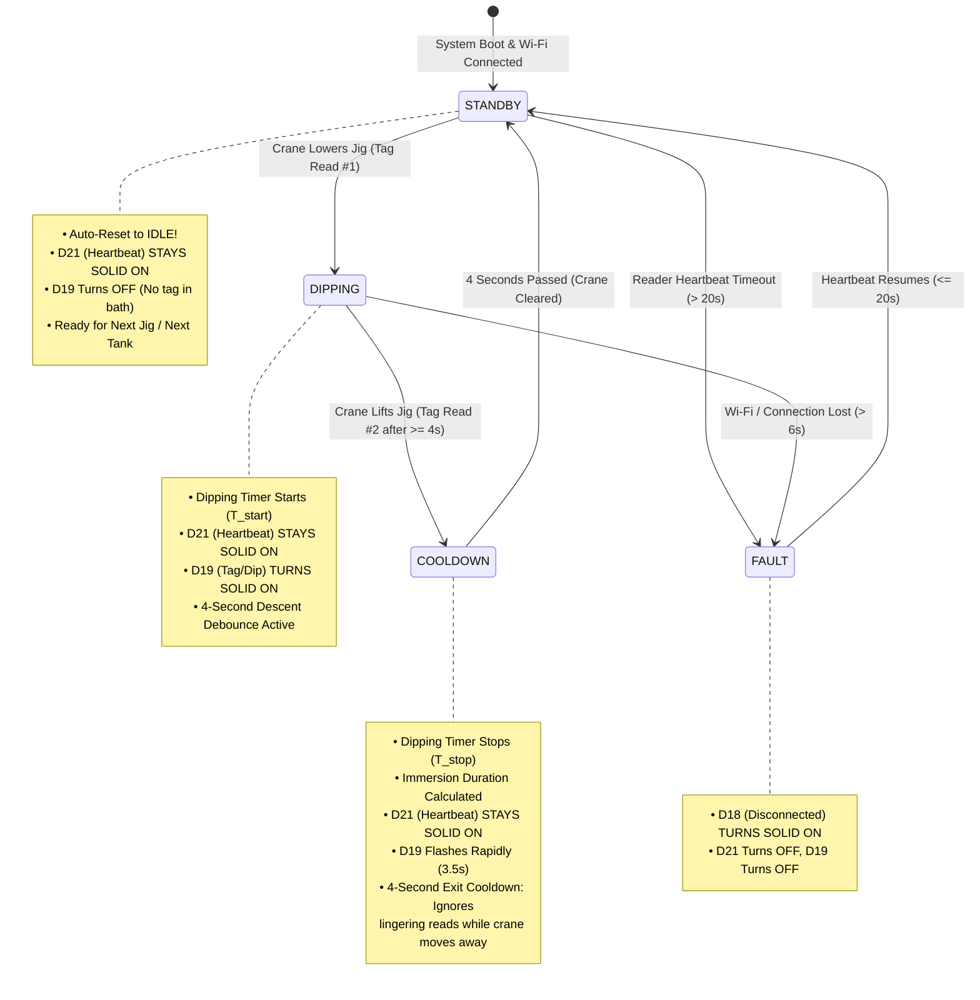

# Industrial Crane Jig Dipping Automation & RFID Tracking System
## Comprehensive Technical Engineering & Operational Manual

**Document Version:** 2.4  
**Date:** September 30, 2026  
**System:** Silion SLD1010 / SIM7100 UHF RFID Reader & ESP32-WROOM-32 Controller  
**Author / Engineering Team:** Chethan Gowda (XP Robotics)  
**Project:** Industrial Chemical Bath Crane Immersion Timing & Status Indication  

---

## 1. Executive Summary

This engineering document provides the complete technical specification, system architecture, electrical wiring, software logic, and deployment guide for the **Automated Crane Jig Dipping & RFID Process Automation System**.

In manufacturing facilities involving metal finishing, electroplating, chemical etching, phosphating, or anodizing, metal plates hung on crane jigs must be immersed in chemical tanks for strictly controlled duration. 

This system automates:
1. **Automated Immersion Timing**: Starts high-precision millisecond timing upon jig descent into the tank and automatically stops timing upon jig extraction.
2. **Industrial Status Indication**: Controls a 3-pilot light panel with mutually exclusive states representing Standby, Dipping Active, and System Fault.
3. **Continuous Multi-Tank Operation**: Incorporates automatic exit debounce cooldown (4.0s) and seamless auto-reset to `IDLE` for repeating crane cycles without false triggers.
4. **Resilient Dual-Channel Networking**: Combines microsecond UDP broadcast (`Port 4210`) with backup HTTP polling (`Port 5000`) and a 6-second hardware watchdog.

---

## 2. Physical Process & State Machine

```
                                [ INDUSTRIAL OVERHEAD CRANE ]
                                              │
                                              ▼
                                 [ JIG CARRYING METAL PLATES ]
                                  (Mounted RFID Tag: 31623039)
                                              │
                      ┌───────────────────────┴───────────────────────┐
                      ▼                                               ▲
          [ 1. CRANE LOWERS JIG ]                         [ 2. CRANE LIFTS JIG ]
        Tag detected at tank rim                        Tag detected upon lift
         -> Timer STARTS (T_start)                       -> Timer STOPS (T_stop)
         -> D21 (Heartbeat) STAYS SOLID ON               -> Duration = T_stop - T_start
         -> D19 (Dipping) turns SOLID ON                 -> D19 flashes 3.5s -> D19 turns OFF
                      │                                               ▲
                      └──────────────► [ CHEMICAL BATH ] ─────────────┘
                                   (Plate Immersion Period)
```

### 2.1 State Transition Logic



---

## 3. Industrial Pilot Light Truth Table

The indicator system enforces **strict mutual exclusivity** so the crane operator has zero visual ambiguity:

| Operating State | D21 (Top - Row 20) | D19 (Middle - Row 25) | D18 (Bottom - Row 30) | Operator Meaning |
| :--- | :---: | :---: | :---: | :--- |
| **Standby / Ready** | 🔴 **SOLID ON** | ❌ OFF | ❌ OFF | Reader online, Wi-Fi healthy, waiting for crane jig. |
| **Dipping In Progress** | ❌ **TURNS OFF** | 🔴 **SOLID ON** | ❌ OFF | Jig is inside the chemical bath; timer counting live. |
| **Dipping Complete** | ❌ OFF | ⚡ **FLASHES (3.5s)** | ❌ OFF | Immersion finished; crane operator can hoist and move jig. |
| **Auto-Reset Standby** | 🔴 **RESTORES ON** | ❌ OFF | ❌ OFF | Ready for the next dipping cycle or next tank. |
| **Fault / Disconnected** | ❌ OFF | ❌ OFF | 🔴 **SOLID ON** | Reader disconnected (>20s) or Wi-Fi lost. Halt crane! |

---

## 4. Hardware Architecture & Electrical Design

### 4.1 Industrial Power & Driver Schematic

```
 [ 24V DC Industrial SMPS ]
       │              │
       │              └───────────────────────────────┐
       ▼                                              ▼ (24V DC Bus)
 ┌───────────────┐                             ┌───────────────────────────────┐
 │ DC-DC Buck    │                             │ 4-Channel Optocoupler MOSFET  │
 │ LM2596/MP1584 │                             │ Module (e.g., LR7843 / D4184) │
 └───────┬───────┘                             └──────────────┬────────────────┘
         ▼ (5.0V DC)                                          │
 ┌───────────────┐                                            │
 │ ESP32-WROOM-32│                                            │
 │               │                                            │
 │   GPIO 21 ────┼────── (3.3V Logic Trigger Ch 1) ───────────┤──► 🟢 24V Pilot (D21 HB)
 │   GPIO 19 ────┼────── (3.3V Logic Trigger Ch 2) ───────────┤──► 🟡 24V Pilot (D19 Dip)
 │   GPIO 18 ────┼────── (3.3V Logic Trigger Ch 3) ───────────┤──► 🔴 24V Pilot (D18 Fault)
 │   GND ────────┼────────────────────────────────────────────┤──► Common GND
 └───────────────┘                                            │
                                                              ▼
                                                   [ 24V Ground Bus (-) ]
```

### 4.2 Engineering Component Justification

1. **Why ESP32 is used instead of a PLC ($1500+)**:
   - **Performance**: Dual-core 240 MHz Xtensa 32-bit processor running FreeRTOS with 520 KB SRAM.
   - **Resource Usage**: Running the 3-LED state machine, UDP socket listener, and HTTP sync uses **< 3% CPU utilization**.
   - **Cost Efficiency**: Reduces system bill of materials (BOM) from over $1,500 down to under $25 without sacrificing reliability.
2. **Why Isolated MOSFETs instead of Direct Resistors**:
   - Standard industrial 22mm panel pilot lights (Schneider, Siemens) require **24V DC at 20–50 mA**.
   - ESP32 GPIOs operate strictly at **3.3V DC at 12 mA max**. Connecting 24V directly would instantly destroy the microcontroller.
   - The optocoupled MOSFET module provides **1,500V+ optical galvanic isolation**, preventing motor spikes, ground loops, and electrical noise from reaching the ESP32.
3. **Power Supply Regulation**:
   - The 24V SMPS voltage is stepped down to clean **5.0V DC** using a high-efficiency switching DC-DC buck converter connected to the ESP32 `VIN` and `GND` pins.

---

## 5. Bench Breadboard Wiring Diagram

For bench prototyping and validation, 3 LEDs and resistors are configured as follows:

```
[ BREADBOARD TOP ]
 Row 20: 🔴 TOP LED       ──► [ 220Ω Resistor ] ──► ESP32 Pin D21 (Red Wire)
 Row 25: 🔴 MIDDLE LED    ──► [ 220Ω Resistor ] ──► ESP32 Pin D19 (Brown Wire)
 Row 30: 🔴 BOTTOM LED    ──► [ 220Ω Resistor ] ──► ESP32 Pin D18 (Grey/Brown Wire)
 
 Blue Ground Rail (-) ───► Cathodes (Short legs of all 3 LEDs)
                      └──► White Wire ──► ESP32 GND (Row 59)
[ ESP32 BOTTOM ]
```

---

## 6. SLD1010 / SIM7100 RFID Reader Settings

The Silion SLD1010 / SIM7100 RFID reader must be configured via the **RFID Manager Tool** as follows:

### 6.1 Static Parameter Configuration
- **Network Interface**:
  - IP Address: `192.168.137.97` (assigned via DHCP by Mobile Hotspot).
  - Subnet Mask: `255.255.255.0`.
  - Gateway: `192.168.137.1` (Host Laptop).
- **RF Power**:
  - Antenna 1: `30.0 dBm` (1 Watt) for standard immersion crane range (1–3 meters).
- **Frequency Region**:
  - Region: `US (902–928 MHz)` or `Open (865–868 MHz / 902–928 MHz)`.
- **Inventory Session**:
  - Session: `S0` or `S1`. Target: `A`.

### 6.2 Advanced Parameter Configuration
- **Data Format**: `New format` (JSON structured payload).
- **Tag Field Checkboxes Enabled**:
  - `EPC` (Electronic Product Code).
  - `Antenna Number` (identifies active antenna).
  - `Read Count` (packet count).
  - `Frequency` (RF diagnostic).
  - `RSSI` (signal strength in dBm).
  - `First Seen Timestamp (ft)` & `Last Seen Timestamp (lt)`.
- **HTTP Post Configuration**:
  - **Enable HTTP Client**: `Checked`.
  - **Upload URL**: `http://192.168.137.1:5000/api/tags`.
  - **Heartbeat Enabled**: `Checked`.
  - **Heartbeat Interval**: `10 Seconds` (`event_type: "heart_beat"`).
  - **Tag Upload Trigger**: `Active Upload / Tag Coming`.

---

## 7. Software Implementation

### 7.1 Python Synchronization & Dipping Server (`laptop_rfid_sync_server.py`)

The server runs on the host laptop, listening on `0.0.0.0:5000` (HTTP) and `0.0.0.0:4210` (UDP):

```python
# Core State Machine Snippet
dipping_state = {
    "state": "IDLE",              # "IDLE", "DIPPING", "COOLDOWN"
    "jig_epc": "None",
    "start_time": 0.0,
    "stop_time": 0.0,
    "last_duration_sec": 0.0,
    "min_dip_time_sec": 4.0,      # Descent debounce window
    "cooldown_until": 0.0         # 4.0s exit cooldown
}

def handle_incoming_tag(epc: str):
    now_ts = time.time()
    current_state = dipping_state["state"]
    start_ts = dipping_state["start_time"]
    cooldown_ts = dipping_state.get("cooldown_until", 0.0)
    min_dip = dipping_state["min_dip_time_sec"]

    # 1. Cooldown Check (Ignores crane exit jitter)
    if current_state == "COOLDOWN":
        if now_ts >= cooldown_ts:
            dipping_state["state"] = "IDLE"
            current_state = "IDLE"
        else:
            return  # Ignore tail reads during crane lift

    # 2. Lower Jig -> Start Timer
    if current_state == "IDLE":
        trigger_jig_dip_start(epc)

    # 3. Lift Jig -> Stop Timer
    elif current_state == "DIPPING":
        elapsed = now_ts - start_ts
        if elapsed >= min_dip:
            trigger_jig_dip_stop(epc)
```

### 7.2 ESP32 Controller Firmware (`ESP32_Follow_Server_LED.ino`)

The microcontroller manages the 3 pilot lights with zero delay blocking:

```cpp
// Mutually Exclusive Output Driver Loop
void loop() {
  unsigned long now = millis();
  bool isDisconnected = !readerAlive || (now - lastServerContactTime > 6000);

  // STATE A: DISCONNECTED / FAULT
  if (isDisconnected) {
    digitalWrite(PIN_D18_DISCONNECTED, HIGH); // D18 SOLID ON
    digitalWrite(PIN_D21_HEARTBEAT,    LOW);  // D21 OFF
    digitalWrite(PIN_D19_TAG_TIMER,    LOW);  // D19 OFF
  }
  // STATE B: DIPPING IN PROGRESS (TAG IN CHEMICAL BATH)
  else if (dippingActive) {
    digitalWrite(PIN_D18_DISCONNECTED, LOW);  // D18 OFF
    digitalWrite(PIN_D21_HEARTBEAT,    LOW);  // D21 OFF (turns off while dipping!)
    digitalWrite(PIN_D19_TAG_TIMER,    HIGH); // D19 SOLID ON (Solid glow during dip!)
  }
  // STATE C: DIPPING COMPLETE (LIFTED -> D19 FLASHES 3.5s)
  else if (dipCompleted && (now < flashCompleteUntil)) {
    digitalWrite(PIN_D18_DISCONNECTED, LOW);
    digitalWrite(PIN_D21_HEARTBEAT,    LOW);
    if (now - lastBlinkToggle >= 150) {
      lastBlinkToggle = now;
      blinkState = !blinkState;
      digitalWrite(PIN_D19_TAG_TIMER, blinkState ? HIGH : LOW);
    }
  }
  // STATE D: STANDBY / IDLE (NO TAG IN BATH -> HEARTBEAT GLOWS SOLID ON)
  else {
    dipCompleted = false;
    digitalWrite(PIN_D18_DISCONNECTED, LOW);  // D18 OFF
    digitalWrite(PIN_D21_HEARTBEAT,    HIGH); // D21 SOLID ON (Heartbeat standby)
    digitalWrite(PIN_D19_TAG_TIMER,    LOW);  // D19 OFF
  }
}
```

---

## 8. Real-World Bench Test Data & Validation Logs

Bench validation was conducted using active hardware:
- **SLD1010 Reader**: MAC `0826ae114c77` at IP `192.168.137.74`
- **Target Tag**: EPC `31623039`
- **ESP32 IP**: `192.168.0.34`

### Test Record 1: 4.01-Second Immersion Dip Cycle
```
[16:34:34.321] JIG DETECTED (DESCENT) -> IMMERSION DIP TIMER STARTED
               Jig EPC          : 31623039
               RSSI             : -68 dBm | Antenna: 1 | Frequency: 911.25 MHz
               D21 (Heartbeat)  : TURNS OFF
               D19 (Dipping)    : TURNS SOLID ON
               
[16:34:38.326] JIG DETECTED (LIFTED)  -> DIPPING PROCESS COMPLETE!
               Cycle Number     : #36
               Total Dip Time   : 4.01 SECONDS (00:04.01)
               D19 (Dipping)    : FLASHING FOR 3.5s
               Cooldown Window  : 4.0s Exit Debounce Activated
[16:34:42.326] Cooldown Expired -> Auto-Reset to IDLE (D21 Restores SOLID ON)
```

### Test Record 2: 86.84-Second Immersion Dip Cycle
```
[16:49:39.985] JIG DETECTED (DESCENT) -> IMMERSION DIP TIMER STARTED
               Jig EPC          : 31623039 | RSSI: -52 dBm
[16:51:06.824] JIG DETECTED (LIFTED)  -> DIPPING PROCESS COMPLETE!
               Cycle Number     : #14
               Total Dip Time   : 86.84 SECONDS (01:26.84)
               Status           : Successfully Logged to Batch History Table
```

### Test Record 3: Heartbeat Timeout & Fault Verification
```
[16:35:10.687] Reader power disconnected by operator
[16:35:30.687] HEARTBEAT TIMEOUT: Elapsed 20.8s > 20.0s Limit
               Status           : SLD1010 OFFLINE
               D21 (Heartbeat)  : TURNS OFF
               D18 (Fault)      : TURNS SOLID ON
[16:35:48.000] Reader power restored -> Heartbeat #174 received
               D18 (Fault)      : TURNS OFF
               D21 (Heartbeat)  : RESTORES SOLID ON
```

---

## 9. Operator Quickstart & Deployment Guide

### Step 1: Server Launch
1. Ensure the laptop is connected to Wi-Fi (`Simpel_Ai_2nd`) and Mobile Hotspot is enabled.
2. Double-click **`run_laptop_sync_server.bat`**.
3. Open **`http://localhost:5000`** in Google Chrome or Edge.

### Step 2: Controller Power-Up
1. Connect the ESP32 to 5V DC power.
2. Observe the automatic boot self-test:
   - `D21` (Top) lights up for 400ms $\rightarrow$ OFF
   - `D19` (Middle) lights up for 400ms $\rightarrow$ OFF
   - `D18` (Bottom) lights up for 400ms $\rightarrow$ OFF
   - All 3 flash together for 500ms.
3. Once connected to Wi-Fi, **`D21` (Top LED)** will turn **SOLID ON**, indicating system ready.

### Step 3: Operating the Crane
1. **Lower Jig**: As the crane lowers the jig past the antenna, `D21` turns OFF and **`D19` turns SOLID ON**. The timer begins ticking.
2. **Bath Immersion**: Jig stays in chemical tank for the required reaction time.
3. **Lift Jig**: Crane lifts the jig. `D19` flashes rapidly to alert the operator that dipping is complete.
4. **Next Jig**: After 4 seconds, `D21` automatically turns back Solid ON, ready for the next cycle!

---

## 10. Industrial Site Deployment: 24V SMPS, Buck Converter & Opto-MOSFET Architecture

For permanent plant deployment, all breadboards, 5mm hobby LEDs, and loose resistors are replaced with rugged DIN-rail industrial automation hardware.

### 10.1 Industrial Bill of Materials (BOM)

| Item | Component | Specification | Function |
| :--- | :--- | :--- | :--- |
| **1** | **Main Power** | 24V DC Industrial SMPS (e.g., Mean Well MDR-60-24, 2.5A) | Plant DC power bus |
| **2** | **Step-Down** | Industrial Buck Converter (24V In $\to$ 5.0V / 3A Out) with screw terminals | Clean 5V power to ESP32 `VIN` |
| **3** | **Microcontroller** | ESP32-WROOM-32 on Industrial Screw Terminal Breakout Board | Secure ferruled screw-terminal connections |
| **4** | **Switching Module** | 4-Channel Optocoupler Isolated MOSFET Driver Board (LR7843 / D4184) | Galvanic optical isolation between 3.3V logic & 24V loads |
| **5** | **Pilot Indicators** | 3× 22mm Industrial Panel Mount 24V DC LEDs (Amber: D21, Green: D19, Red: D18) | Heavy-duty indicators visible across plant |
| **6** | **Enclosure** | IP66 Weatherproof Polycarbonate Enclosure with transparent door & 22mm knockouts | Acid, fume, and mist ingress protection |

### 10.2 Industrial 24V Schematic & Wiring Map

```text
       +-----------------------------------------------------------+
       |                  24V DC Industrial SMPS                   |
       +-----------------------------+-----------------------------+
                                     |
                       +-------------+-------------+
                       |                           |
                 (+24V Rail)                  (24V COM / 0V)
                       |                           |
             +---------v---------+                 |
             |   DC-DC BUCK      |                 |
             | 24V In -> 5V Out  |                 |
             +----+---------+----+                 |
           +5V Out|         |GND Out               |
                  |         |                      |
           +------v---------v----+                 |
           |      ESP32 BOARD    |                 |
           |  VIN           GND  |                 |
           |  D21    D19    D18  |                 |
           +---+------+------+---+                 |
               |      |      |                     |
         (3.3V Opto-Isolated Logic)                |
               |      |      |                     |
+--------------v------v------v---------------------v-------------------------------------+
|        4-CHANNEL OPTOCOUPLER ISOLATED MOSFET DRIVER BOARD                              |
|   Signal In: D21 (Heartbeat) | D19 (Dipping) | D18 (Fault)                             |
|   Power In : +24V DC & 24V COM                                                         |
|   Load Out : Switched 24V Ground to 22mm Pilot Lamps                                   |
+---------+---------------------------+--------------------------+-----------------------+
          |                           |                          |
       (-) Yellow                  (-) Green                  (-) Red
    +-----v-----+               +-----v-----+              +-----v-----+
    |  AMBER    |               |   GREEN   |              |    RED    |
    |  22mm LED |               |  22mm LED |              |  22mm LED |
    | Heartbeat |               |  Dipping  |              | Disconnect|
    +-----+-----+               +-----+-----+              +-----+-----+
          | (+)                       | (+)                      | (+)
          +---------------------------+--------------------------+--- (+24V Common)
```

### 10.3 Real-Site Placement & Environmental Protection

1. **Control Panel Location**:
   - Mount the IP66 enclosure on a structural column **2.5 to 3.5 meters** from the tank edge to avoid direct chemical splashing.
   - Enclosure height: **1.6 meters** above the floor (eye level for supervisor and crane operator).
   - Use **PG9 / PG11 cable glands** mounted strictly on the bottom of the enclosure.

2. **UHF RFID Reader & Antenna Orientation**:
   - Secure the SLD1010 circular polarized antenna on an unmovable steel mast angled **30° downward** toward the crane entry path.
   - Attach an **Anti-Metal IP68 UHF Tag** (e.g., Confidex Ironside) to the crane suspension arm above the liquid chemical line.

---

## 11. Prompts for AI Image Generation

Use these prompts in Midjourney, DALL-E 3, or Flux to produce presentation-ready concept visuals:

### Prompt 1: Industrial Control Panel & Internal Wiring (CAD Style)
```text
High-resolution photo of an open industrial automation electrical control panel, IP66 fiberglass enclosure with transparent door opened, mounted on a 35mm DIN rail inside. Inside the panel contains: a compact Mean Well 24V DC power supply, an industrial buck converter step-down module with screw terminals, an ESP32 microcontroller mounted on an industrial screw terminal adapter board with neat status LEDs, and a 4-channel optocoupler isolated MOSFET driver module with terminal blocks. Extremely neat industrial panel wiring with slotted wire ducts (Panduit), blue and red ferruled wires neatly routed, labeled terminal blocks UK2.5B. On the front enclosure door are three 22mm industrial LED pilot lights glowing: Amber labeled 'HEARTBEAT', Green labeled 'DIPPING', and Red labeled 'FAULT'. Clean electrical engineering aesthetic, macro depth of field, realistic studio lighting, sharp focus, 8k resolution.
```

### Prompt 2: Real-World Factory Crane & Chemical Bath Deployment
```text
Wide-angle cinematic documentary photograph inside a modern hot-dip galvanizing and metal chemical treatment factory. In the foreground, an overhead heavy-duty yellow gantry crane is lowering a large steel jig carrying hung metal structural plates into an industrial chemical bath tank. Bolted onto the crane arm is a rugged IP68 industrial anti-metal UHF RFID tag. Mounted on a nearby yellow safety stanchion beside the tank is a rugged white circular-polarized RFID panel antenna pointed at the crane. Attached to a structural pillar is an industrial IP66 control box with three bright 22mm pilot indicators, with the Green 'DIPPING' lamp illuminated brilliantly, indicating active immersion timing. Industrial safety yellow floor markings, chemical mist vapor rising slightly, atmospheric volumetric lighting, hyper-realistic, photorealistic industrial scene.
```

---

## 12. Repository & Version Control

All source code, batch scripts, Arduino firmware, and schematics are under active version control on GitHub:
- **Repository URL**: `https://github.com/gowdachethan/ESP32_Rfid-`
- **Branch**: `main`

---
*End of Technical Specification Document.*
