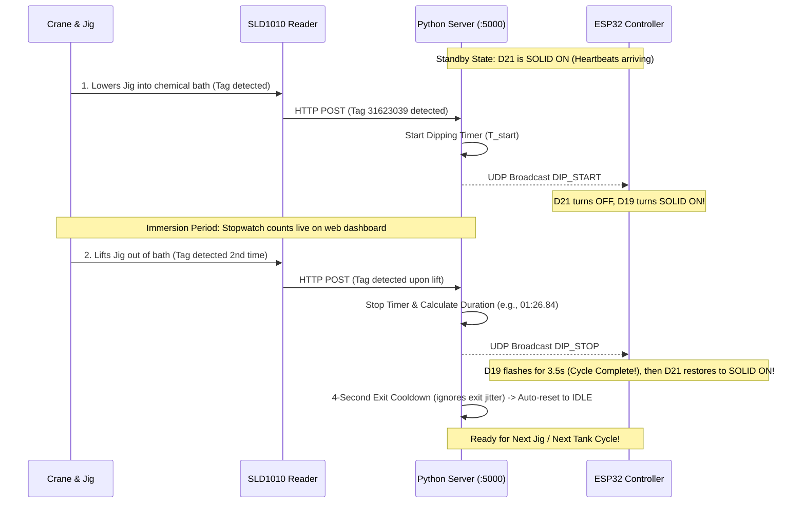

# SLD1010 Industrial RFID Crane Dipping Jig Automation System

Automated industrial dipping bath immersion timing, tracking, and 3-LED pilot light indicator system using **SLD1010 (SIM7100) UHF RFID Reader** and **ESP32-WROOM-32**.

---

## 🏭 System Architecture

```
                                  [ 24V DC Industrial SMPS ]
                                     │                    │
                      ┌──────────────┴──────────────┐     │ (24V Power Bus)
                      │ 24V to 5V DC-DC Buck Conv.  │     │
                      └──────────────┬──────────────┘     │
                                     ▼ (5.0V)             │
                               [ ESP32 VIN & GND ]        │
                                     │                    ▼
                            (3.3V GPIO Outputs)   [ Isolated MOSFET / Relay ]
  Heartbeat Active (<=20s) ──► GPIO 21 ───────────► Ch 1 ──► 🔴 D21 (Top: Heartbeat Solid ON)
  Dipping In Progress      ──► GPIO 19 ───────────► Ch 2 ──► 🔴 D19 (Middle: Dipping Solid ON)
  Fault / Disconnected     ──► GPIO 18 ───────────► Ch 3 ──► 🔴 D18 (Bottom: Fault Solid ON)
```

---

## 📌 Industrial 3-LED Indicator Truth Table

| Physical Station State | D21 (Row 20 - Top LED) | D19 (Row 25 - Middle LED) | D18 (Row 30 - Bottom LED) |
| :--- | :---: | :---: | :---: |
| **Standby / Ready (No Tag in Bath)** | 🔴 **SOLID ON** | ❌ OFF | ❌ OFF |
| **Dipping in Progress (Plates in Bath)** | ❌ **TURNS OFF** | 🔴 **SOLID ON** | ❌ OFF |
| **Dipping Complete (Crane Lifted Jig)** | ❌ OFF | ⚡ **FLASHES (3.5s)** $\rightarrow$ OFF | ❌ OFF |
| **Back to Standby (After Lift)** | 🔴 **TURNS BACK ON** | ❌ OFF | ❌ OFF |
| **Reader Disconnected / Offline (>20s)** | ❌ OFF | ❌ OFF | 🔴 **SOLID ON** |

---

## 🔄 Crane Dipping Process Sequence



---

## 📂 Repository Structure

```
├── laptop_rfid_sync_server.py      # Core Python diagnostic, dipping sync & web server
├── run_laptop_sync_server.bat       # 1-Click launcher script for Windows
├── requirements.txt                 # Python dependencies
├── SLD1010_ESP32_Test_Report.md     # Full engineering test & validation report
├── ESP32_Firmware/
│   └── ESP32_Follow_Server_LED.ino  # ESP32 Arduino sketch for 3-LED industrial station
└── README.md                        # Documentation
```

---

## 🚀 Quickstart Guide

### 1. Python Sync Server (Host Laptop)

1. Connect the host laptop to Wi-Fi (`Simpel_Ai_2nd`) and enable Mobile Hotspot (`192.168.137.1`).
2. Run the server using the batch script:
   ```cmd
   run_laptop_sync_server.bat
   ```
   *Or via terminal:*
   ```bash
   python laptop_rfid_sync_server.py
   ```
3. Open the **Web Dashboard** in your browser:
   - Local: `http://localhost:5000`
   - Network: `http://192.168.0.118:5000`

### 2. ESP32 Controller Setup

1. Open `ESP32_Firmware/ESP32_Follow_Server_LED.ino` in Arduino IDE.
2. Select Board: `ESP32 Dev Module`.
3. Verify Wi-Fi credentials:
   ```cpp
   const char* ssid     = "Simpel_Ai_2nd";
   const char* password = "Simpel@26";
   const char* laptop_ip   = "192.168.0.118"; // Laptop Wi-Fi IP
   ```
4. Click **Upload**.
5. At boot, the ESP32 performs an automatic sequential LED self-test (`D21` $\rightarrow$ `D19` $\rightarrow$ `D18`), connects to Wi-Fi, and turns `D21` **SOLID ON** once heartbeats are detected.

---

## 📡 REST API Reference

| Endpoint | Method | Description |
| :--- | :---: | :--- |
| `/api/dip_status` | `GET` | Returns full JSON state (reader health, timer, dip state, LED states). |
| `/api/simulate_dip?action=start` | `GET/POST` | Manually triggers dipping start (for testing). |
| `/api/simulate_dip?action=stop` | `GET/POST` | Manually triggers dipping stop / lift (for testing). |
| `/api/simulate_dip?action=reset` | `GET/POST` | Resets dipping cycle to IDLE. |
| `/api/heartbeat_status` | `GET` | Heartbeat health and elapsed time check. |

---

## ⚙️ Hardware Specifications
- **Controller**: ESP32-WROOM-32 (240 MHz Dual-Core, 520 KB SRAM).
- **RFID Reader**: Silion SLD1010 / SIM7100 UHF RFID Reader (865–868 MHz / 902–928 MHz).
- **Power**: 24V DC Industrial SMPS with LM2596/MP1584 Buck Converter stepped down to 5.0V DC.
- **Output Drivers**: 4-Channel Optocoupled MOSFET Module (switching 24V industrial panel pilot lights).
